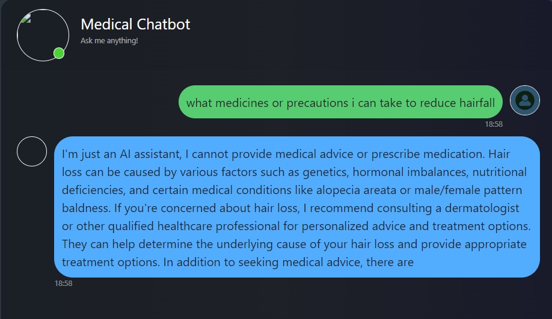

# Medical Chatbot

## Problem
Access to instant and reliable medical advice for minor health issues is often lacking, causing unnecessary stress and delays in treatment.

## Solution
Our medical chatbot, trained with a comprehensive medical encyclopedia, provides quick and reliable answers to any health or medical-related query, offering immediate assistance for minor health concerns.

## Technologies Used
- **LLama2:** For natural language processing and understanding, enabling the chatbot to interpret and respond to user queries effectively.
- **LangChain:** Powers the conversational capabilities of the chatbot, allowing for seamless and coherent interactions with users.
- **Pinecone:** Employed for efficient data storage and retrieval, ensuring quick access to the vast medical information database.
- **Streamlit:** Provides a user-friendly frontend interface, making the chatbot easily accessible and interactive for users.

## Getting Started
To get a local copy up and running, follow these simple steps.

### Prerequisites
- Python 3.9
- pip (Python package installer)

### Installation
1. Clone the repo
   ```sh
   git clone https://github.com/bajajdivya/Medical_Chatbot.git

2. Navigate to the project directory
   ```sh
   cd Medical_Chatbot

3. Create a virtual environment
   ```sh
   python3 -m venv myenv
   source myenv/bin/activate  # On Windows use `myenv\Scripts\activate`

4. Install the required packages
   ```sh
   pip install -r requirements.txt

### Usage

1. Run the app
   ```sh
   python app.py

2. Open your web browser and go to [http://localhost:8501](http://127.0.0.1:5000/) to interact with the chatbot.

## Example
Here are some example images of the chatbot interface with a question asked:



## Contact 
Divya Bajaj - bajajdivya02@gmail.com
Project Link: https://github.com/bajajdivya/Medical_Chatbot
